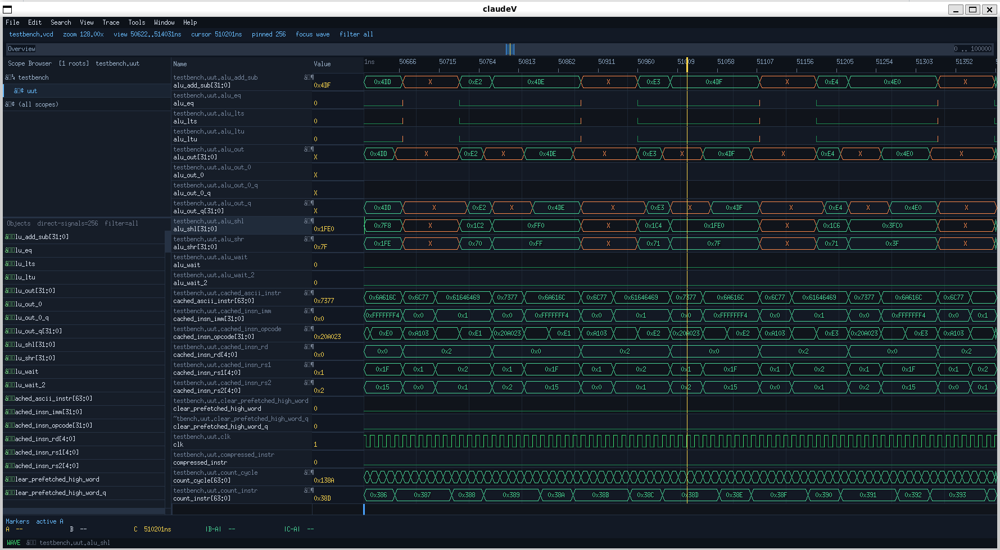

# claudeV

A native X11 VCD (Value Change Dump) waveform viewer written in Rust, built for use on Linux and Termux (Android). No Electron, no browser, no GTK/Qt — just one dependency: `x11rb`.



## Features

- **Three-panel layout**: module tree → signal list → waveforms
- **Module hierarchy browser** — navigate `$scope` blocks, expand/collapse modules
- **Pin signals** to the waveform view individually or an entire module at once
- **Multi-bit bus expansion** — expand any bus to individual bit lanes
- **Full signal path** shown in the name column (`testbench.uut.mem_addr[31:0]`)
- **Pixel-accurate waveform rendering** — dense transitions (e.g. fast clocks) render as an activity bar instead of going blank
- **Zoom & pan** — keyboard or mouse scroll wheel, zoom centred on cursor position
- **Fit all** — one key to show the entire simulation time
- **Cursor** with per-signal value display at cursor time
- **Next/prev edge** jump on selected signal
- **End-of-simulation marker** — bright line at `max_time` on ruler and waveform body
- Binary search for value lookup — fast even with 500+ signals
- Handles multi-character VCD identifiers (>95 signals per file)
- Double-buffered rendering, no flicker on resize

## Dependencies

```toml
[dependencies]
x11rb = { version = "0.13", features = ["allow-unsafe-code"] }
```

That's it.

## Build

```bash
cargo build --release
```

### Termux (Android)

Works out of the box with Termux-X11. Install Termux-X11 from their [GitHub releases](https://github.com/termux/termux-x11/releases), then:

```bash
# Start the X server in Termux
termux-x11 :1 &
export DISPLAY=:1

cargo run --release -- myfile.vcd
```

If the Unix socket path doesn't resolve, use TCP instead:

```bash
export DISPLAY=localhost:1
```

Or pass `-d` directly:

```bash
target/release/claudeV -d localhost:1 myfile.vcd
```

## Usage

```
claudeV [-d DISPLAY] [file.vcd]

  -d, --display   X display string (e.g. :0  :1  localhost:0)
  -h, --help      Show this help
```

Press `s` to load a built-in sample VCD if no file is given.

## Layout

```
┌─ MODULE ──────┬─ SIGNALS ──────┬─ waveform name ──────┬─ waveforms ──────────┐
│ [-] testbench │ ► clk          │ testbench.clk        │  ‾‾‾‾‾‾╮╭‾‾‾‾‾‾     │
│   ► clk       │ ► mem_addr     │ clk                  │        ╰╯            │
│   ► rst       │ ► mem_valid    │ testbench.mem_addr   │  ╟──0x1F──╢╟─0x20──  │
│ [-] uut       │   alu_out      │ mem_addr[31:0]  0x1F │                      │
│     alu_out   │                │                      │                      │
└───────────────┴────────────────┴──────────────────────┴──────────────────────┘
```

Focus cycles through the three panels with `Tab`. The active panel is highlighted with a bright border and labelled in the status bar.

## Keybindings

### Global

| Key | Action |
|-----|--------|
| `Tab` | Cycle focus: Module → Signals → Wave |
| `+` / `-` | Zoom in / out ×2 |
| `f` / `0` | Fit entire simulation into view |
| `h` / `←` | Pan left 10% |
| `l` / `→` | Pan right 10% |
| `H` | Jump to time 0 |
| `L` | Jump to end |
| `c` | Place cursor at view centre |
| `C` | Clear cursor |
| `[` / `]` | Nudge cursor left / right |
| `n` / `N` | Jump to next / prev edge on selected signal |
| `s` | Load built-in sample VCD |
| `?` | Show keybinding summary in status bar |
| `q` / `Esc` | Quit |
| Mouse scroll | Zoom in/out centred on pointer |

### Module panel

| Key | Action |
|-----|--------|
| `j` / `k` | Navigate |
| `Enter` | Expand / collapse module |
| `a` | Add selected signal to waveform |
| `A` | Add all signals in selected module |

### Signals panel

| Key | Action |
|-----|--------|
| `j` / `k` | Navigate |
| `a` | Toggle signal in waveform |
| `A` | Add all listed signals |
| `d` / `Del` | Remove signal from waveform |

### Waveform panel

| Key | Action |
|-----|--------|
| `j` / `k` | Select signal row |
| `J` / `K` | Move selected signal down / up |
| `d` / `Del` | Remove signal from view |
| `e` / `Enter` | Expand bus to individual bits (or collapse) |

## VCD Support

- `$timescale`, `$scope`/`$upscope`, `$var`, `$dumpvars`
- Wire types, scalar (`0`/`1`/`x`/`z`) and vector (`b...`) value changes
- Multi-character signal identifiers
- Multiple nested scopes
- Tested against output from [sisvsim](https://github.com/your-org/sisvsim)


